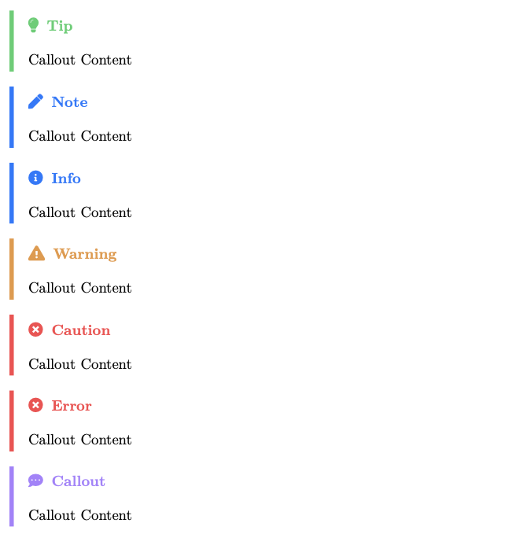
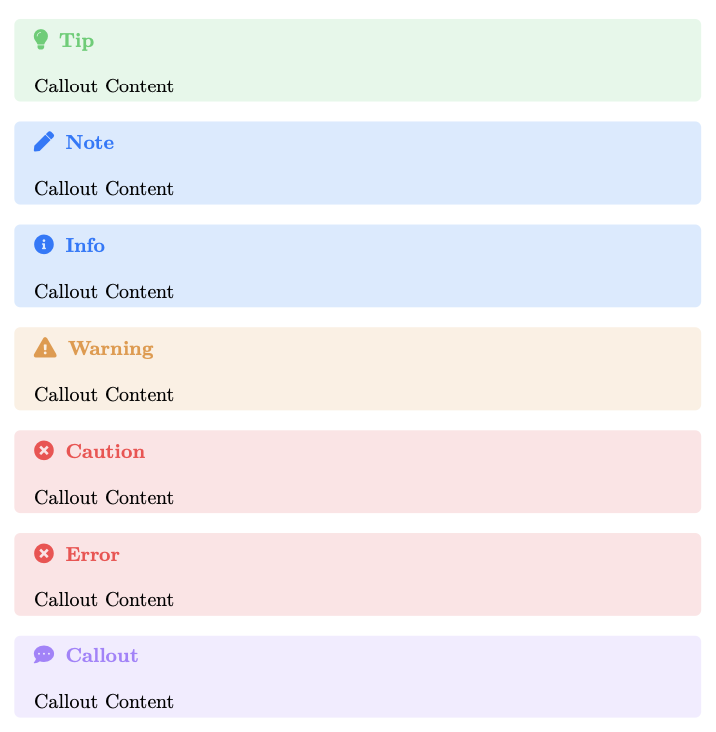

# Latex Callouts

This [pandoc lua-filter](https://pandoc.org/filters.html) uses the mdframed package to create custom callouts looking similar to obsidian callouts or github alerts.

| Github Alerts    | Obsidian Callouts |
| ---------------- | ------------------ |
|  |  |

## Installation

Clone the project.
```sh
git clone https://github.com/mirkosprojects/latex-callouts.git
```

### Global Installation (Recommended)
Place the `callouts.lua` in your pandoc filters folder.
- **Unix/MacOS**: `/Users/USERNAME/.local/share/pandoc/filters/` or `/Users/USERNAME/.pandoc/filters/`
- **Windows**: `C:\Users\USERNAME\AppData\Roaming\pandoc\filters\`

> [!NOTE]
> If the folders don't exist, you have to create them manually

### Local Installation
Move the `callouts.lua` to your project folder.

## Usage

### Build the examples
Run the build commands.
```sh
pandoc github-alerts.md --lua-filter=callouts.lua -o github-alerts.pdf
```
```sh
pandoc obsidian-callouts.md --lua-filter=callouts.lua -o obsidian-callouts.pdf
```

### Usage in your own project
Copy the `header-includes` YAML metadata from `github-alerts.md` or `obsidian-callouts.md` into your own markdown file.

Write your callouts in the format:
```md
> [!NOTE] Callout Title
> Callout Content
```
See the `github-alerts.md` and `obsidian-callouts.md` for details.

Add the filter `--lua-filter=callouts.lua` to your pandoc command.

### Customize Callouts
You can add custom callout styles by adding them to the `header-includes`:
```yaml
- \definecolor{calloutColor<NAME>}{HTML}{<COLOR>}
- \newcommand{\calloutIcon<NAME>}{<ICON>}
```
- Replace `<NAME>` with the name of your custom callout
- Replace `<NAME>` with a hex color value
- Replace `<ICON>` with any [fontawesome5](https://mirror.dogado.de/tex-archive/fonts/fontawesome5/doc/fontawesome5.pdf) icon

Use the callout as follows:
```md
> [!<NAME>] Custom callout
> Callout Content
```